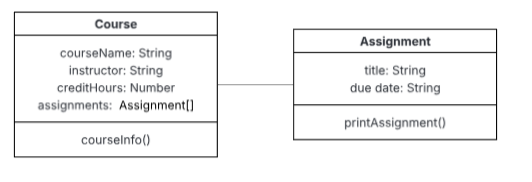

# Mini Project 1: Constructor Functions & Class Notation

In this mini-project, you’ll practice different ways of creating objects in JavaScript. You’ll start with plain object literals (given to you in plainObjects.js) and then rewrite the same functionality using constructor functions and classes.

Although these three approaches look different, they all produce the same kind of result: regular JavaScript objects whose behavior comes from a prototype. Constructors and classes don’t create special kinds of objects — they’re just shorthand for setting up prototypes and shared methods more conveniently.

The class syntax mainly helps organize your code and make it easier to read, while constructor functions give you similar control using a more traditional syntax. Both approaches follow object-oriented design ideas, allowing us to apply concepts like encapsulation. But under the hood, all of these are still the same kind of JavaScript objects linked through prototypes.

As you can see in the above UML diagram, we have two concepts, 'Course' and  'Assignment'. Each of them has methods and attributes/ properties. The file named 'plainObjects.js' implements the given design using plain object literals. From the perspective of readability and ease of use, this approach isn’t the best way to organize the code. For example, the functions are defined separately but are meant to work with specific objects, and there’s duplication in how similar properties are created. These choices in organization can easily lead to errors.

## Task 1: Using Constructor Functions

In the file 'constructorFunctions.js', create two constructor functions for the two concepts 'Employee' and 'Task' and re-organize the code in plainObjects.js so that the objects are created using the constructor functions and the script prints the same output of plainObject.js

## Task 2: Using the Class Notation

In the file named 'classNotation.js' re-organize the code again to use the class notation and give the same output.

### Rubric (Total 6 Points)

| Criteria                           | Points | Description |
|------------------------------------|--------|-------------|
| **Code Organization & Use of Constructor Functions (2 points)** | 0-2    | - **0 points**: Constructor function version not implemented or non-functional. - **1 point**: Partially implemented constructor version, but has major issues (e.g., incorrect constructors or UML design not followed). - **2 points**: Correctly implemented constructor version, all objects are properly created using constructors, and the output matches the original code. |
| **Implementation of Class Notation (2 points)** | 0-2    | - **0 points**: Class notation version not implemented or non-functional. - **1 point**: Partially implemented class version, but has major issues (e.g., UML design not followed, incorrect methods). - **2 points**: Correctly implemented class version, all functionality is achieved using class notation, and the output matches the original code. |
| **Code Clarity & Comments (1 point)** | 0-1    | - **0 points**: Code lacks clarity, is hard to understand, and lacks appropriate comments. - **1 point**: Code is well-organized, structured, and has appropriate comments explaining key parts. |
| **Maintaining Same Output (1 point)** | 0-1    | - **0 points**: Output does not match the original `plainObjects.js` version. - **1 point**: Output matches the original `plainObjects.js` version. |